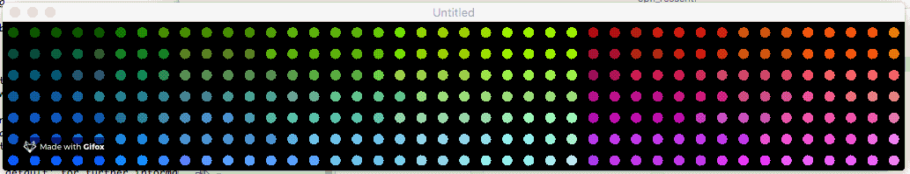

# disp_led_simul
Petite simulation d'un panneau d'affichage à LED RGB en LUA script


## Buts
Si on veut se fabriquer un *grand* panneau d'affichage avec des LED RGB WS2812, vient tout de suite le problème de combien de LED RGB va-t-on mettre en X et en Y afin de pouvoir avoir l'affichage désiré.

Ce petit simulateur de panneau de LED RGB écrit en LUA va nous permettre de voir le résultat avant de commencer à souder :-)

Il a été écrit en LUA car le micro contrôleur utilisé pour ce projet sera un NodeMCU LUA !

Aussi il ne travaille pas avec une *matrice* mais avec un vecteur RGB, car c'est le vecteur RGB utilisé dans la lib LUA ws8212 du NodeMCU (pas encore terminé cette partie)


## Résultats
7 lignes de 42 LED, soit 294 LED RGB




## Installation

### Sous Linux
```
sudo add-apt-repository ppa:bartbes/love-stable
sudo apt update
sudo apt install lua love
```

### Sous MAC
Il faut descendre ceci et le dezipper:

https://bitbucket.org/rude/love/downloads/love-11.2-macos.zip


## Utilisation

### Sous Linux
```
cd project folder
love .
```

### Sous MAC
```
cd project folder
/Applications/love.app/Contents/MacOS/love .
```


## Sources
### Librairie graphique utilisée pour ce projet
http://lua-users.org/wiki/LuaGraphics<br>
https://love2d.org/<br>
https://love2d.org/wiki/love.graphics<br>

### NodeMCU Lua WS2812 RGB Matrix displays
https://github.com/rudiniemeijer/NodeMCU-Lua-WS2812-matrix-displays

### Librairie LED RGB WS2812 de NodeMCU
https://nodemcu.readthedocs.io/en/master/modules/ws2812/

### Tutoriel Lua quand on a un trou de mémoire :-)
https://wxlua.developpez.com/tutoriels/lua/general/cours-complet/

### NodeMCU ESP8286, mais c'est si simple ;-)
https://docs.google.com/document/d/1q64uK3IMOgEDdKaIAttbYuFt4GuLQ06k3FLeyfCsWLg/edit?usp=sharing

### Réalisation complètement loufoque d'un panneau de LED RGB
https://www.youtube.com/watch?time_continue=468&v=fz2QAV9z_o8

### Ruban de LED RGB WS2812/WS2813
https://www.aliexpress.com/item/1m-4m-5m-WS2813-Dual-signal-wires-30-60-pixels-leds-m-Smart-led-pixel-strip/32699391341.htm


zf190524.1618
